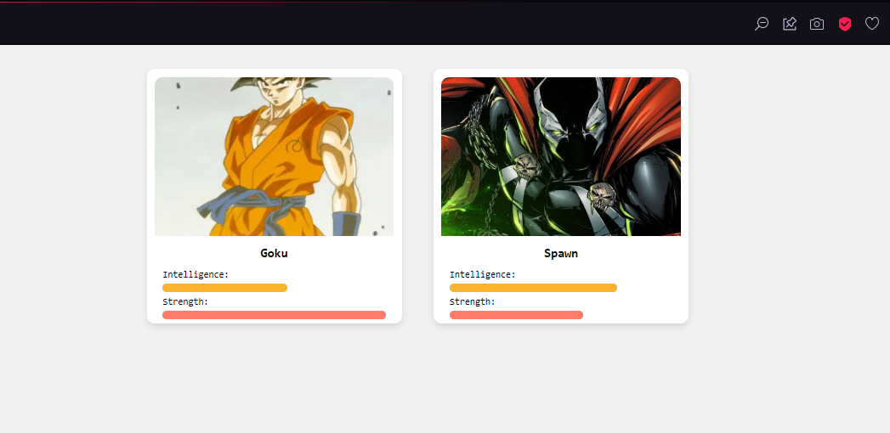

**Wagner Araujo Marcelino Junior** RA: 10440125
# POC SuperHero

Este é o projeto **POC SuperHero**, que utiliza a API [SuperHero API](https://superheroapi.com/) para exibir informações de heróis em um layout responsivo.




## Objetivo

Recriar uma aplicação de exibição de cards de heróis utilizando **Next.js**. A aplicação utiliza uma lista fixa de IDs para buscar dados da API e renderizar informações como nome, imagem, inteligência e força dos heróis.

## Tecnologias Utilizadas

- **Next.js**: Framework React para desenvolvimento web.
- **Axios**: Biblioteca para fazer requisições HTTP.
- **CSS**: Estilização dos cards e layout.

## Pré-requisitos

Certifique-se de ter instalado em sua máquina:
- Node.js (v16 ou superior)
- Gerenciador de pacotes npm ou yarn

## Como Executar o Projeto

1. Clone o repositório:
   ```bash
   git clone <URL_DO_REPOSITORIO>
   cd poc-superhero
   ```

2. Instale as dependências:
   ```bash
   npm install
   ```

3. Configure seu token de acesso:
   - Substitua a variável `ACCESS_TOKEN` no arquivo `page.js` pelo seu token da API [SuperHero API](https://superheroapi.com/).

4. Inicie o servidor de desenvolvimento:
   ```bash
   npm run dev
   ```

5. Acesse a aplicação:
   - Abra seu navegador e acesse [http://localhost:3000](http://localhost:3000).

## Estrutura do Projeto

- **`src/app/page.js`**: Contém a lógica principal da aplicação e a integração com a API.
- **`src/app/globals.css`**: Estilos globais da aplicação.
- **`package.json`**: Gerenciamento de dependências.

## Funcionalidades

- Renderização de cards de heróis com:
  - Imagem
  - Nome
  - Barras de inteligência e força
- IDs de heróis fixos para a API.

## Personalização

- **Alteração de IDs**: Você pode personalizar a lista de heróis editando os IDs no arquivo `page.js`.
- **Estilização**: Altere os estilos no arquivo `globals.css` para personalizar a aparência.

## Exemplo de IDs de Heróis

- Goku: ID 289
- Spawn: ID 612

Para mais IDs, consulte a [documentação oficial da API](https://superheroapi.com/).
